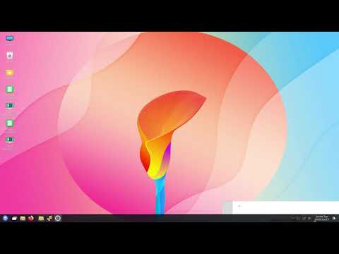

<h2 align="center"><u>ukui-manjaro</u></h2>

<h4 align="center"> ukui-manjaro Repository Readme </h4>

 

### [+] Description

Repository created to generate a manjaro iso with UKUI desktop for everyone, every first day of the month
